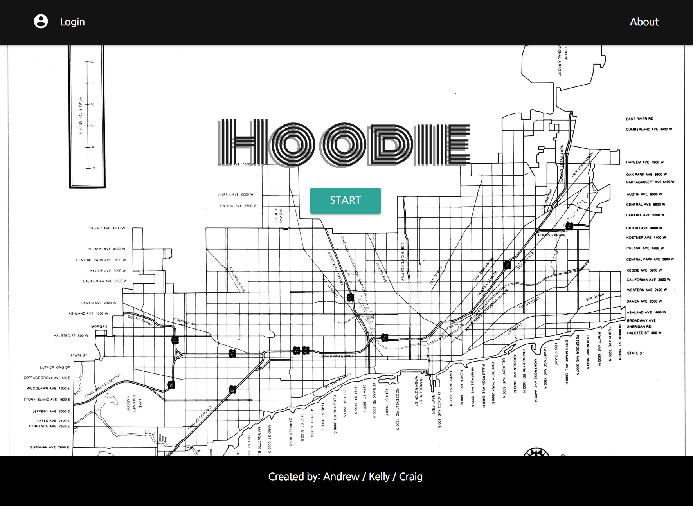
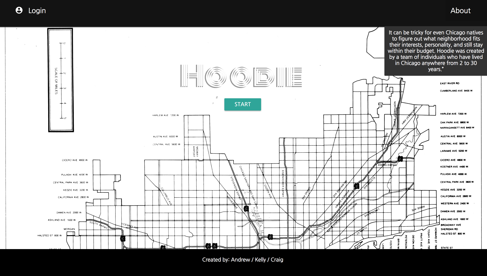
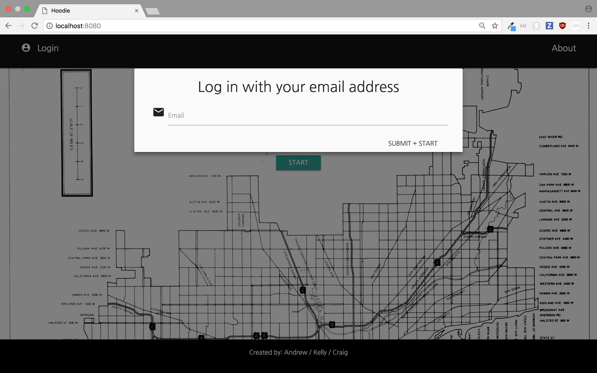
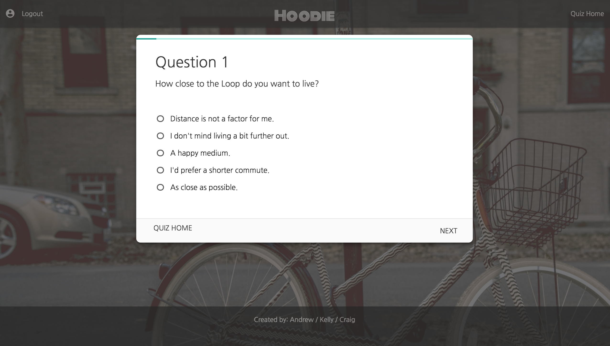
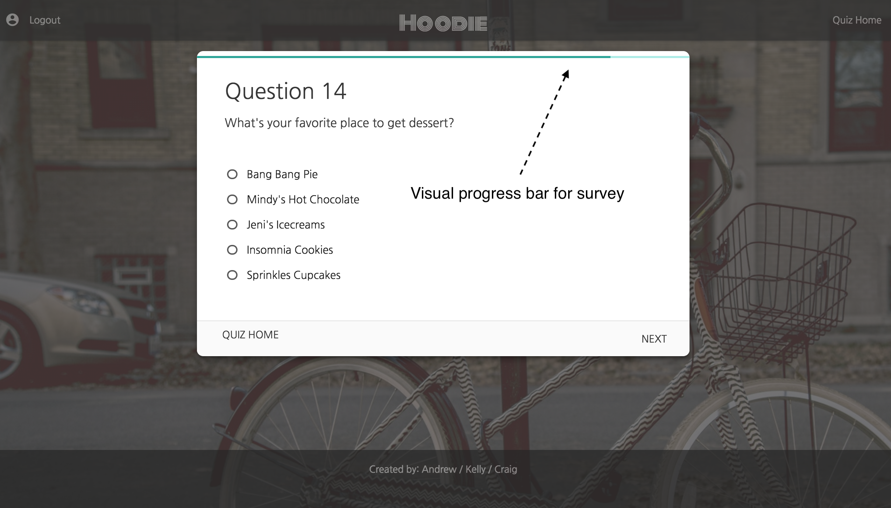
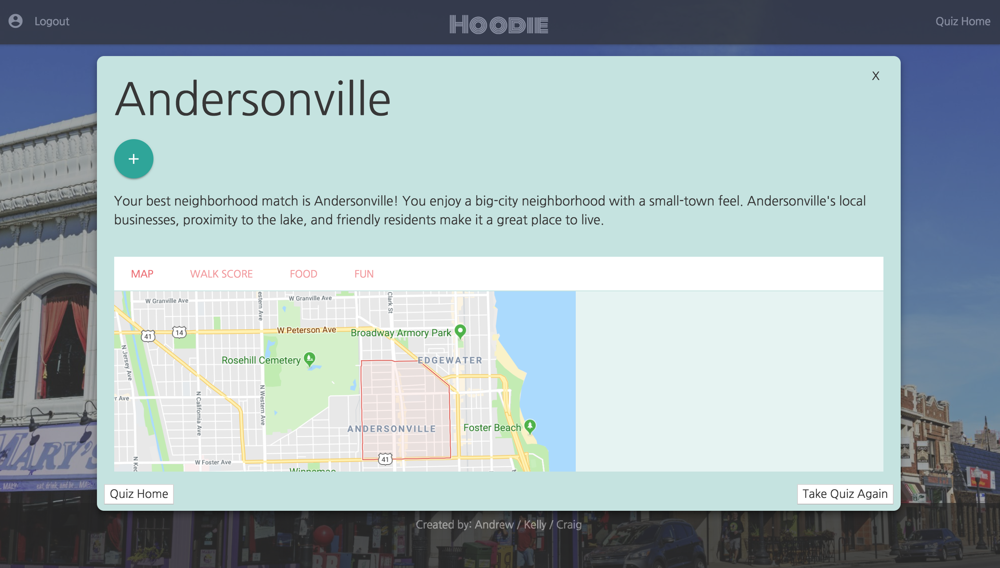
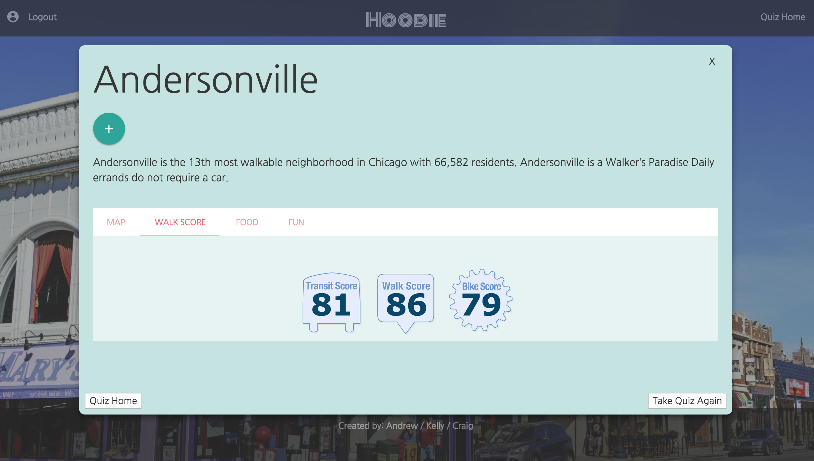
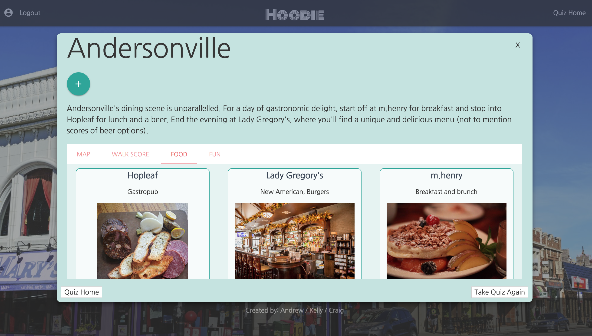
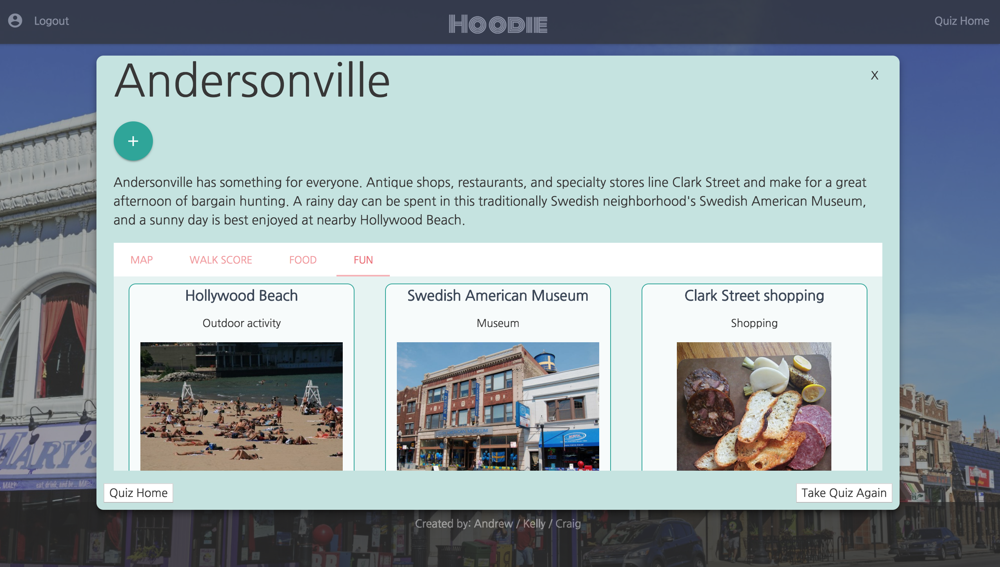

# Neighborhood-Finder

There are more than 200 neighborhood areas in Chicago - that's why it's known as a "city of neighborhoods." Narrowing down the neighborhood that's right for you can be tricky, especially if you're from out of town. Hoodie helps you find your place in the city. 

## Built With

- Materialze
- jQuery
- MySQL Workbench 

## Screenshots

How the home page looks like.

About Hoodie at the top right corner of the screen.

You can login with your email and take the survey or just go straight to the survey. If you decide to not login with an email address first then Hoodie will not remember what your results were if you decide to come back and take the survey at a later time.

How the survey page looks like.

We added a progress bar so you can keep track of how many questions you have left.

After you have finished taking the survey Hoodie will match you up with the neighborhood that's right for you and it will also include a map of the area, walkscore, restaurants and entertainment that's in the area.

Walkscore.

Restaurants. 

Entertainment.

## Authors

**Kelly Hagan** (https://github.com/haganka)
**Craig Dupuis** (https://github.com/CraigD89)
**Andrew Zdunek** (https://github.com/ajzdunek)

